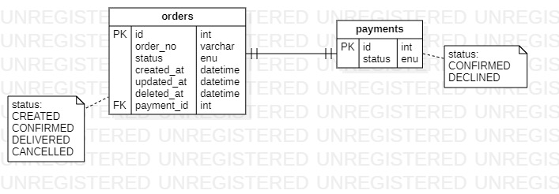

# node/assessment
Space monorepo microservices repo that managed by Yarn Workspace & Lerna

<br />

## Services: 
1. **Asgard** :fleur_de_lis: -> Master library for other repo to use
2. **payment** :vertical_traffic_light: -> -payment micro-services
3. **order** :trident: -> order micro-services
---
<br />

## Tools
**Lerna** as monorepo management tools
**Yarn** as default package manager, utilize yarn workspace to maintain multiple workspace
**VsCode** as default code editor as customized launch.json to utilize VsCode debug
**Nodemon** as hot-reload module
**ExpressJS** as default http web server
**Winston + Morgan** as logging mechanism tools
**Knex** as default query builder
**Objection** as default ORM
**routing-controller** used to manage express messy routing
---

<br>

## Pre-requisite
#### 1. Yarn, go to the official web to install OR if you have npm
```bash
npm i -g yarn
```
#### 2. Lerna
```bash
npm i -g lerna
```
#### 3. Bootstrap
```bash
lerna bootstrap
```

## ERD
```
Attachment of ERD designed
```


## To test out
```
npm run migrate
npm run dev
http://localhost:8085/v1/app/order
```

## Notes
```
About deployment I'm not sure, half boiled-egg as DevOps.
Some feedback, please allow candidate to submit other project or assessment which has similarity to the test.
Look out for easter egg ;) (UB, NW, migration??)

I didn't write any test case, too tired to do it. Please forgive me
```